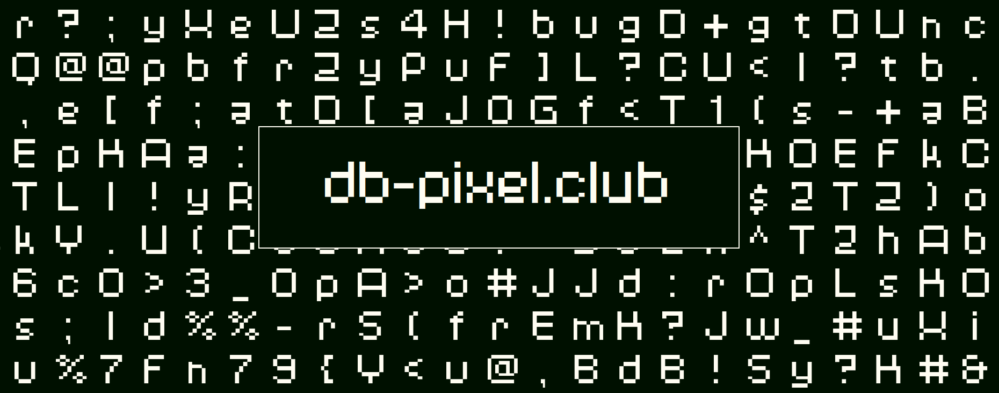

# db-pixel

A retro-inspired sans-serif font, initially created for personal branding. This font combines modern design with pixel art aesthetics.



## Features

### Current Character Set
- Lowercase alphabet (a-z)
- Uppercase alphabet (A-Z)
- Numbers (0-9)
- Punctuation marks and symbols:
  - Comma (,)
  - Period (.)
  - Underscore (_)
  - Exclamation mark (!)
  - Question mark (?)
  - Colon (:)
  - Semicolon (;)
  - Brackets ([ and ])
  - Braces ({ and })
  - Parentheses (( and ))
  - Angle brackets (< and >)
  - At symbol (@)
  - Percent (%)
  - Pound (#)
  - Pipe symbol (|)
  - Double quote (")
  - Forward slash (/)
  - Backslash (\)
  - Hyphen (-)
  - Tilde (~)

### File Formats
The font is available in two formats in the `Build` directory:
- OpenType Font (.otf)
- TrueType Font (.ttf)

## Installation

1. Navigate to the `Build` directory
2. Copy the desired font files (.otf or .ttf) to your system's font directory
3. Install the font on your system

### System-specific Installation

#### Windows
- Right-click the font file
- Select "Install" or "Install for all users"

#### macOS
- Double-click the font file
- Click "Install Font" in the Font Book application

#### Linux
- Copy the font files to `~/.local/share/fonts/` or `/usr/share/fonts/`
- Run `fc-cache -f -v` to update the font cache

## Development

### Tools Used
- Inkscape: For vector graphics and initial design
- FontForge: For font creation and editing

### Project Structure
```
db-pixel/
├── Build/         # Compiled font files
├── img/           # Project images and assets
├── src/           # Source files
├── web/           # Web documentation and preview
└── db-pixel.sfd   # FontForge source file
```

### Contributing
This project is open source and welcomes contributions! Feel free to:
1. Fork the repository
2. Create a feature branch
3. Make your changes
4. Submit a pull request

## Version History

See [CHANGELOG.md](CHANGELOG.md) for detailed version history and updates.

## License

This font is completely free and open source. You are free to:
- Use it in personal and commercial projects
- Modify and distribute it
- Include it in other projects
